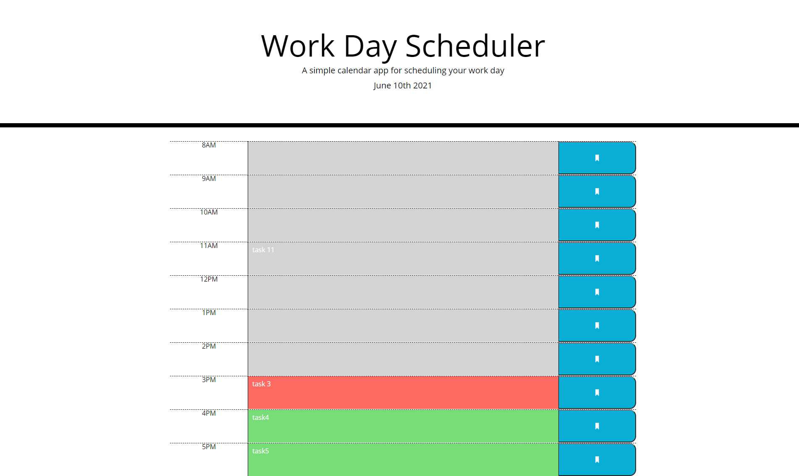

# Work Day Scheduler

## Work day scheduler for 8-5 work day.
Get your work day on track with this easy to use scheduler for your office or work from home job.
Simply add the task in the feild next to the hour of the day you need and save it by clicking on the save blue button on the right. The tasks will save in the local storage and will be there next time you open the scheduler that day. New day new workday scheduler, yes its that simple.

## Technologies 
* HTML5
* CSS
* JavaScript

Link to website: https://anaumov1.github.io/work-day-scheduler/

## Table of contents
* [Installation](#installation)
* [Usage](#usage)
* [Credits](#credits)
* [License](#license)

## Installation

To install all the files for the "Work Day Scheduler" website please clone this https://github.com/anaumov1/work-day-scheduler.git repository to your computer. For instructions on how to clone a repository from GitHub follow this link: https://docs.github.com/en/github/creating-cloning-and-archiving-repositories/cloning-a-repository

## Usage

"Work Day Scheduler" is a simple scheduler web site with separate fields for every work hour based on 8-5 workday. Once ou navigate to the website you will see the current day displayed above the scheduler, than you can see the actual scheduller, every hour is a separate row with time, task input area and a save button.
Scheduller is color coded, green = future hours, red = current hour and gray = past hours.

## Credits
The initial HTML and CSS files provided by UT Coding Bootcamp.

## Licence

Copyright (c) [2021] [Alexandru Naumov]

Permission is hereby granted, free of charge, to any person obtaining a copy
of this software and associated documentation files (the "Software"), to deal
in the Software without restriction, including without limitation the rights
to use, copy, modify, merge, publish, distribute, sublicense, and/or sell
copies of the Software, and to permit persons to whom the Software is
furnished to do so, subject to the following conditions:

The above copyright notice and this permission notice shall be included in all
copies or substantial portions of the Software.

THE SOFTWARE IS PROVIDED "AS IS", WITHOUT WARRANTY OF ANY KIND, EXPRESS OR
IMPLIED, INCLUDING BUT NOT LIMITED TO THE WARRANTIES OF MERCHANTABILITY,
FITNESS FOR A PARTICULAR PURPOSE AND NONINFRINGEMENT. IN NO EVENT SHALL THE
AUTHORS OR COPYRIGHT HOLDERS BE LIABLE FOR ANY CLAIM, DAMAGES OR OTHER
LIABILITY, WHETHER IN AN ACTION OF CONTRACT, TORT OR OTHERWISE, ARISING FROM,
OUT OF OR IN CONNECTION WITH THE SOFTWARE OR THE USE OR OTHER DEALINGS IN THE
SOFTWARE.
